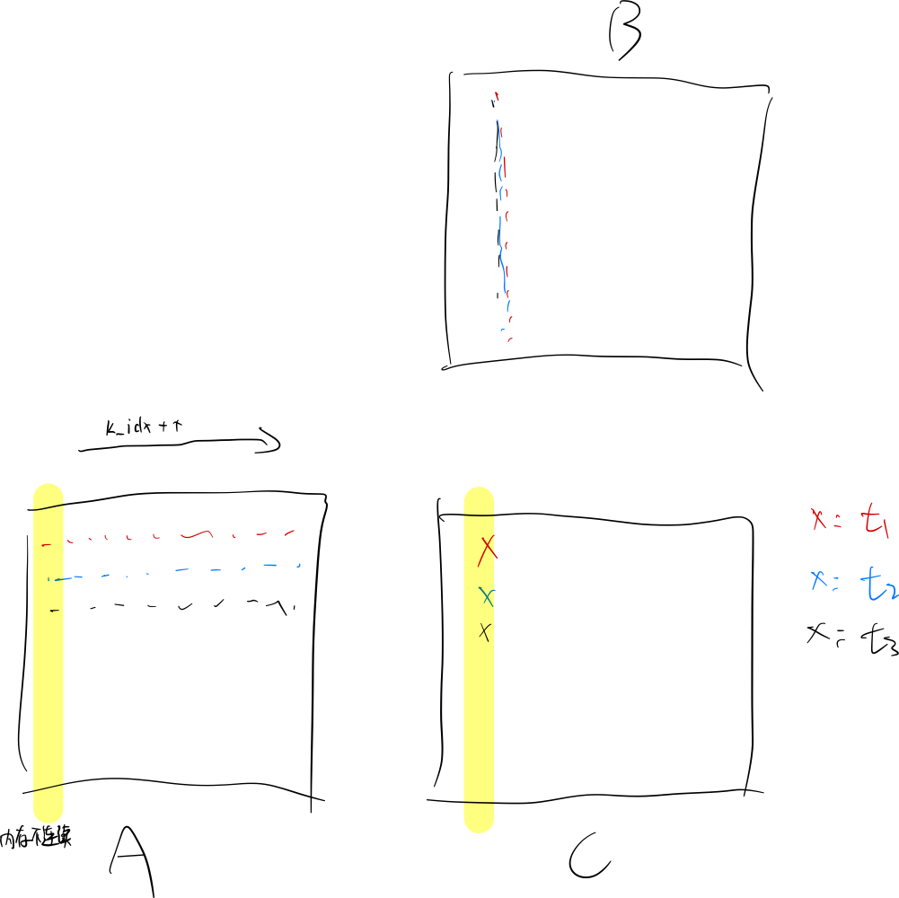
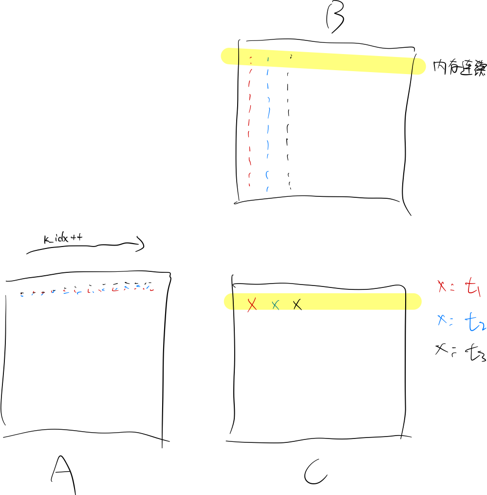

# cuda-gemm-example


# Introduction

本仓库介绍了CUDA GEMM kernel的实现和优化。

## General Matrix Multiplication

GEMM计算$C = AB + C$, 其中 $A\in\mathbf{R}^{m\times k}$, $B\in\mathbf{R}^{k\times n}$, $C\in\mathbf{R}^{m\times n}$。


# Implementation

## 1. naive 实现

### 思路

每个线程负责计算`C`矩阵中的一个元素；

每个线程从`A`矩阵中读取`k`个元素，从`B`矩阵中读取`k`个元素，执行`k`次乘法和`k`次加法操作。`A`和`B`矩阵的数据都存放在global memory中；

### 代码

```c++
template <typename T>
__global__ void gemm_v1(size_t m, size_t n, size_t k, T alpha, const T *A,
                        size_t lda, const T *B, size_t ldb, T beta, T *C,
                        size_t ldc) {
  size_t C_row_idx = blockIdx.x * blockDim.x + threadIdx.x;
  size_t C_col_idx = blockIdx.y * blockDim.y + threadIdx.y;

  if (C_row_idx < m and C_col_idx < n) {
    T sum = static_cast<T>(0);
    for (size_t k_idx = 0; k_idx < k; ++k_idx) {
      sum += A[C_row_idx * lda + k_idx] * B[k_idx * lda + C_col_idx];
    }
    C[C_row_idx * ldc + C_col_idx] = sum;
  }
}
```


### 分析

`C_row_idx`代表当前线程要计算的`C`矩阵中的元素的行索引；
`C_col_idx`代表当前线程要计算的`C`矩阵中的元素的列索引；

在一个warp中，`threadIdx.x`是连续的，从0到31，因此`C_row_idx`对应的索引也是连续的；

如下图所示，连续的thread计算`C`矩阵中的一列元素


这就导致了一个问题：同一个warp中的所有线程，访问`A`矩阵的同一列元素，同样写入`C`矩阵的同一列。在访问`A`矩阵和写入`C`矩阵内存时，数据的内存地址不是连续的，从而导致non-coalesced memory access，从而降低了带宽利用率。

因此，只需要调换计算`C_row_idx`和`C_col_idx`的顺序，即可解决这个问题；

## 2. coalesced memory access实现

### 代码

```c++
template <typename T>
__global__ void gemm_v1(size_t m, size_t n, size_t k, T alpha, const T *A,
                        size_t lda, const T *B, size_t ldb, T beta, T *C,
                        size_t ldc) {
  size_t C_row_idx = blockIdx.y * blockDim.y + threadIdx.y;
  size_t C_col_idx = blockIdx.x * blockDim.x + threadIdx.x;

  if (C_row_idx < m and C_col_idx < n) {
    T sum = static_cast<T>(0);
    for (size_t k_idx = 0; k_idx < k; ++k_idx) {
      sum += A[C_row_idx * lda + k_idx] * B[k_idx * lda + C_col_idx];
    }
    C[C_row_idx * ldc + C_col_idx] = sum;
  }
}
```

### 分析

调换`C_row_idx`和`C_row_idx`的顺序后，`threadIdx.x`是连续的，从0到31，相应的`C_col_idx`是连续的；

